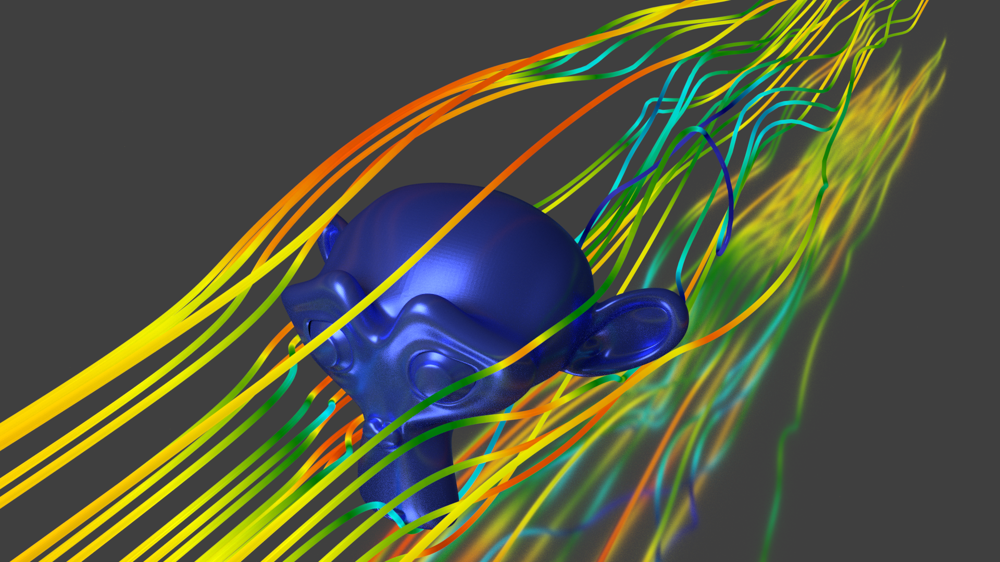
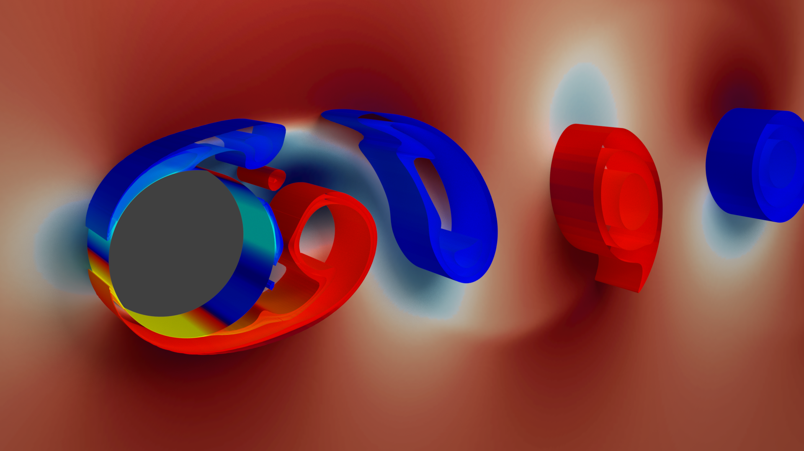

# Blender Pipeline

Scripts and examples on how to visualize scientific data with Blender. This repository is meant to go alongside with the tutorial provided at the [FLEXI website](https://www.flexi-project.org/?page_id=1136).

## Scripts

The folder `scripts` contains the scripts that are used to automate many tasks regarding the visualization of scientific data.

### animate_paraview.py

Use this python script to automatically generate postprocessed data for many files in a time series using ParaView in a format readable by Blender. 
You first generate a ParaView state (`.pvsm` file) that does the post processing in the way you want to, then use the `animate_paraview.py` script
to apply this state to all your files in the time series and export the resulting data. Use `animate_paraview.py --help`
to see the syntax of the tool.

### animate_blender.py

Again, first generate a Blender layout (`.blend` file) using a single snapshot of the time series that looks like you want it to look. Then delete
all the imported geometry from that layout and save it - the script will later handle the re-import. Now, call Blender in background mode and supply the `animate_blender.py` script to it, which will
render a single image for each of the files in your time series. To set the options of the script, you need to edit the script itself.

## Examples

### Suzanne head

Static visualization of streamlines around the Blender mascot, a monkey head called Suzanne.

### Vortex shedding behind cylinder

Dynamic visualization of vortex shedding behind a circular cylinder.

### Vortical structures downwind of a cylinder at Re=3900

### Flow over a sphere at Re=1000

